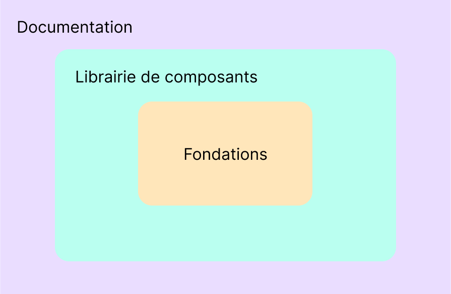

# Atelier: **Design Systems**
13 Novembre 2024 — Jonathan Berger

---

# 1. Théorie

---

## Définition

Un design system est un ensemble complet de normes destinées à gérer la conception à l'échelle (at scale) à l'aide de composants et de modèles réutilisables.

<small>https://www.nngroup.com/articles/design-systems-101/</small>

---

## Pourquoi un design system ?

- **Répétabilité:** création unique puis réplication à l'échelle
- Assure une **cohérence visuelle** entre les pages et produits
- Crée un **langage commun** entre les différentes équipes (design, développement, marketing, produit,...)

---

## Structure d'un design system

---

### Structure: **fondations**

- Définissent le langage visuel
- Couleurs, typographie, icônes, illustrations,...
- Design tokens
  - single source of truth pour les décisions relatives au design
  - paires clé-valeur qui représentent ces décisions
  - Exemple: `color-bg-primary: #ff0000;`

---

### Structure: **Librairie de composants**

- Ensemble de composants utilisables dans un projet
- Basés sur une librairie (React, Vue,...) ou natifs (web components)

Exemple: https://mui.com/material-ui/

---

### Structure: **documentation**

- Site de référence: design.monproduit.com
- API / documentation sur les fondations et la librairie de composants
- Patterns (assemblage de composants)
- Ressources et processus
- Bonnes pratiques,...

Exemple: https://atlassian.design/

---

# 2. Inventaire d'interface

---

## Enjeux

- Déconstruire les pages d'un projet à leur niveau atomique
- Démontre l'importance d'une consistence en terme de design
- Expose la redondance d'une multitude d'éléments qui sont similaires, mais différents
- Premiers pas dans la création d'une librairie de composants

---

## Création

https://www.figma.com/community/file/1090652945374511460

---

## Observations

---

# 3. Design Tokens

---

## Création

- Création des variables dans Figma
- Export des tokens: https://github.com/lukasoppermann/design-tokens/
- Transformation des tokens: https://styledictionary.com

---

# 4. Librairie de composants

---

## Web Components

- Possibilité d'encapsuler du code (HTML, CSS, JS) nativement

---

## Storybook

- Playground pour la création de composants

---

# 3. Les monorepos et Yarn Workspaces

---

## Qu'est-ce que c'est ?

- Monorepo: stratégie qui consiste à placer le code de plusieurs projets dans un seul repository
- Yarn Workspace: fonctionalité de Yarn qui permet de gérer plusieurs packages NPM dans un monorepo

https://yarnpkg.com/features/workspaces

---

## Création d'un monorepo